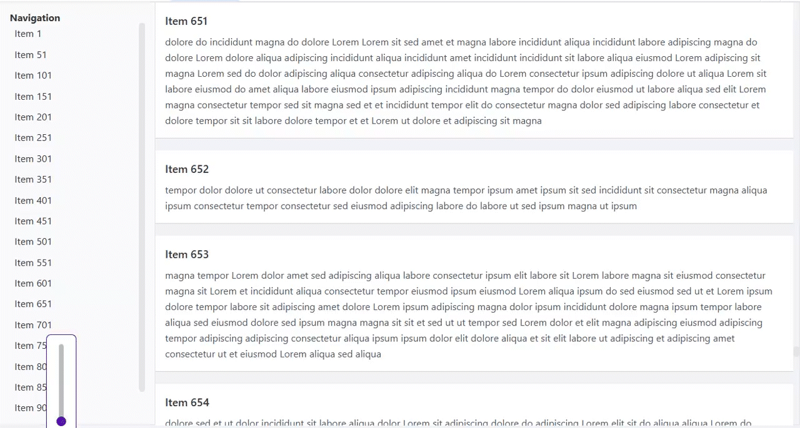

# VirtualScrollByRender 组件 API 文档

## 概述
一个高性能的 Vue 3 虚拟滚动组件，检测真实dom元素高度，且仅渲染可见项目以高效处理大型数据集。

## 快速开始

首先，安装包：

```bash
npm install @vben/elementplusplus
# 或
yarn add @vben/elementplusplus
```

然后在您的 Vue 3 应用程序中导入并使用组件：

```vue
import { VirtualScrollBaseRender } from '@vben/elementplusplus';
```

然后您可以在模板中使用 `VirtualScrollBaseRender` 组件。
```vue
      <VirtualScrollBaseRender
        :items="items"
        :container-height="700"
      >
        <template #default="{ item, api }">
          <div
            class="border-b border-gray-300 bg-white p-4"
            :ref="
              async (ele) => {
                if (ele) {
                  await nextTick();
                  api.measureItemHeight(item.index);
                }
              }
            "
          >
            <div class="mb-2 text-lg font-semibold">
              项目 {{ item.index + 1 }}
            </div>
            <div class="leading-relaxed text-gray-600">{{ item.content }}</div>
          </div>
        </template>
      </VirtualScrollBaseRender>
```

## 属性

| 属性 | 类型 | 默认值 | 描述 |
|------|------|---------|-------------|
| `items` | `Item[]` | **必需** | 要渲染的项目数组。每个项目必须有一个 `index` 属性 |
| `containerHeight` | `number` | `500` | 滚动容器的高度（像素） |
| `visibleItemsCount` | `number` | `50` | 在视口中渲染的项目数量 |
| `estimatedItemHeight` | `number` | `80` | 测量前项目的估计高度 |
| `bufferSize` | `number` | `5` | 在视口外渲染的项目数量，用于平滑滚动 |

## 事件

| 事件 | 参数 | 描述 |
|-------|------------|-------------|
| `scroll` | `(index: number)` | 滚动位置改变时触发 |
| `remove` | `(index: number, id: string)` | 项目从 DOM 中移除时触发 |
| `mouseenter` | `()` | 鼠标进入容器时触发 |

## 暴露的方法

| 方法 | 参数 | 描述 |
|--------|------------|-------------|
| `scrollToItem` | `(index: number)` | 滚动以在顶部显示指定项目 |

## 暴露的属性

| 属性 | 类型 | 描述 |
|----------|------|-------------|
| `firstVisibleIndex` | `Ref<number>` | 第一个可见项目的索引 |
| `renderStartIndex` | `Ref<number>` | 渲染开始的索引（包括缓冲区） |
| `visibleItems` | `Ref<Item[]>` | 当前渲染的项目 |

## 插槽

### 默认插槽
```vue
<template #default="{ item, index }">
  <!-- 您的项目模板 -->
</template>
```

**插槽属性：**
- `item`: 当前项目对象
- `index`: 项目在可见项目数组中的位置

## 使用示例



```vue
<script setup lang="ts">
import { computed, nextTick, onMounted, ref } from 'vue';

import VirtualScrollBaseRender from 'vue3-virtual-scroller-detect-height';

const items = ref<Array<{ content: string; height: number; index: number }>>(
  [],
);
const virtualScrollRef = ref<InstanceType<
  typeof VirtualScrollBaseRender
> | null>(null);

const generateRandomText = () => {
  const words = [
    'Lorem',
    'ipsum',
    'dolor',
    'sit',
    'amet',
    'consectetur',
    'adipiscing',
    'elit',
    'sed',
    'do',
    'eiusmod',
    'tempor',
    'incididunt',
    'ut',
    'labore',
    'et',
    'dolore',
    'magna',
    'aliqua',
  ];
  const length = Math.floor(Math.random() * 200) + 20;
  let text = '';
  for (let i = 0; i < length; i++) {
    text += `${words[Math.floor(Math.random() * words.length)]} `;
  }
  return text.trim();
};

const generateItems = () => {
  for (let i = 0; i < 1000; i++) {
    items.value.push({
      index: i,
      height: 0,
      content: generateRandomText(),
    });
  }
};

const navigateToItem = async (index: number) => {
  virtualScrollRef.value?.scrollToItem(index);
};

const directoryItems = computed(() => {
  return items.value
    .filter((_, index) => index % 50 === 0)
    .map((item) => ({
      index: item.index,
      title: `Item ${item.index + 1}`,
    }));
});

onMounted(() => {
  generateItems();
});
</script>

<template>
  <div class="flex h-[700px] border">
    <div class="flex h-full w-64 flex-col border-r bg-gray-50 p-4">
      <div class="font-bold">Navigation</div>
      <div class="flex-grow overflow-y-auto">
        <div
          v-for="item in directoryItems"
          :key="`dd_${item.index}`"
          @click="navigateToItem(item.index)"
          class="cursor-pointer rounded p-2 hover:bg-blue-100"
        >
          {{ item.title }}
        </div>
      </div>
    </div>

    <div class="flex-1">
      <VirtualScrollBaseRender
        ref="virtualScrollRef"
        :items="items"
        :container-height="700"
        :visible-items-count="50"
        :buffer-size="50"
        :gap="20"
      >
        <template #default="{ item, api }">
          <div
            class="border-b border-gray-300 bg-white p-4"
            :ref="
              async (ele) => {
                if (ele) {
                  await nextTick();
                  api.measureItemHeight(item.index);
                }
              }
            "
          >
            <div class="mb-2 text-lg font-semibold">
              Item {{ item.index + 1 }}
            </div>
            <div class="leading-relaxed text-gray-600">{{ item.content }}</div>
          </div>
        </template>
      </VirtualScrollBaseRender>
    </div>
  </div>
</template>

<style scoped>
/* Add any custom styles if needed */
</style>

```

## 特性

- **动态高度支持**：自动测量并调整到实际项目高度
- **平滑滚动**：缓冲区防止快速滚动时出现空白内容
- **导航支持**：程序化滚动到特定项目
- **性能优化**：仅渲染可见项目 + 缓冲区
- **TypeScript 支持**：具有适当接口的完整类型安全

## 注意事项

- 项目必须具有唯一的 `index` 属性
- 组件使用 `transform: translateY()` 以获得最佳性能
- 高度测量在 DOM 插入后执行
- 缓冲区有助于保持平滑的滚动体验
